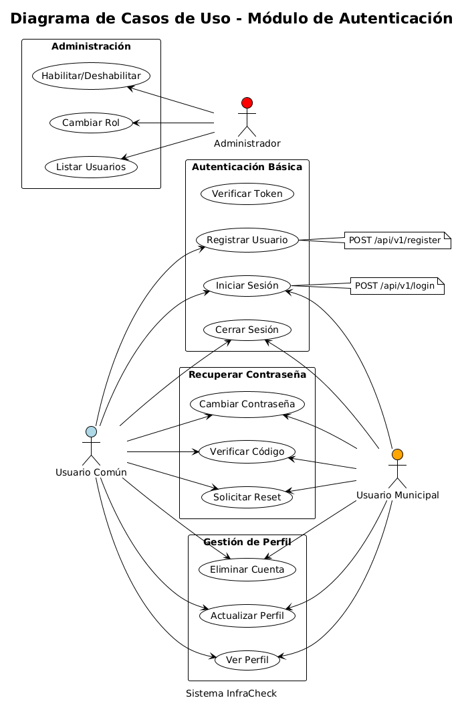
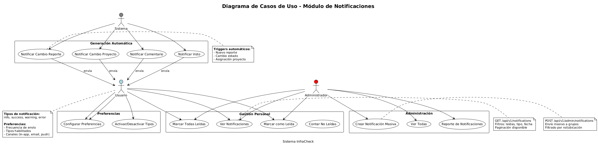
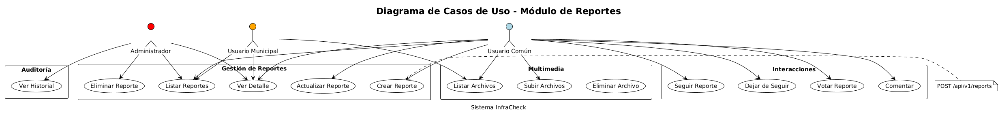
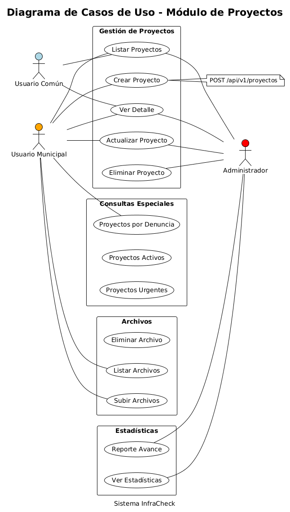
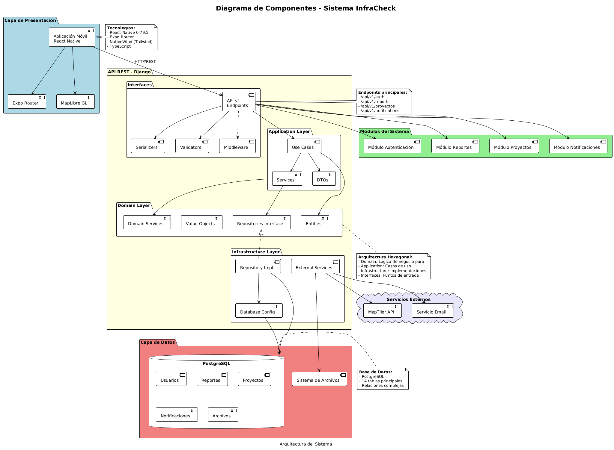

# G3-INFO1173-Infracheck
# Descripción del Proyecto

En Temuco, la gestión de los espacios públicos enfrenta una limitación estructural: la Municipalidad no cuenta con equipos suficientes, personal ni sistemas eficientes para inspeccionar de manera constante el estado de calles, veredas, accesos peatonales y otros elementos clave de la infraestructura urbana. Esta carencia genera una brecha crítica entre el deterioro real del entorno urbano y la capacidad institucional para detectarlo y actuar oportunamente. Como resultado, problemas visibles —como baches, veredas rotas o accesos inaccesibles para personas con discapacidad— permanecen sin solución durante meses, afectando la seguridad, la movilidad y la calidad de vida de los habitantes.

A esto se suma la debilidad en los canales de comunicación entre ciudadanía y municipio. Los mecanismos actuales de reporte (redes sociales, llamadas telefónicas, formularios web) son dispersos, no están integrados y carecen de trazabilidad pública, lo que dificulta el seguimiento y la priorización de los problemas.

Frente a este escenario, se propone el desarrollo de una plataforma digital ciudadana que permita a los habitantes de Temuco reportar problemas de manera geolocalizada, adjuntando fotografías, descripciones y categorizaciones. Los reportes serán públicos y visibles en un mapa dinámico, facilitando la presión social organizada y la priorización democrática de los problemas más urgentes.

La plataforma incluirá un sistema de seguimiento, historial de tiempo sin resolución, votación ciudadana para priorizar problemas, notificaciones automáticas a los departamentos municipales y un dashboard de transparencia con métricas por zona, tipo de problema y tasa de resolución. El objetivo es fortalecer la democracia local, promoviendo una cultura de corresponsabilidad entre habitantes y autoridades, y modernizar los canales de participación ciudadana en Temuco.


### Diagrama de Arquitectura de Software


### Diagrama de Casos de Uso(AUTENTICACION)

### Diagrama de Casos de Uso (NOTIFICACIONES)

### Diagrama de Casos de Uso(REPORTES)

### Diagrama de Casos de Uso(PROYECTOS)


### Diagrama de Componentes


### Modelo Entidad-Relación (MER)


## Arquitectura del Sistema


## Diagramas de Referencia del Proyecto

  - **React Native:** `0.79.5` - Aplicación móvil multiplataforma para iOS y Android
  - **Expo:** `^53.0.22` - Plataforma de desarrollo y build
  - **Expo Router:** `~5.1.5` - Sistema de navegación basado en archivos
  - **NativeWind:** Framework de estilos usando clases de Tailwind CSS
  - **TypeScript:** `~5.8.3` - Tipado estático para mayor robustez del código
  - **React:** `19.0.0` - Biblioteca de componentes UI
  - **SafeAreaView:** Manejo seguro de áreas de visualización en dispositivos
  - **Componentes modulares:** Arquitectura basada en componentes reutilizables

- **Arquitectura Backend:** 
  - **Django:** Framework web de Python para API REST

- **Diseño de Base de Datos:** 
  - **PostgreSQL:** Base de datos relacional principal

- **Autenticación y Autorización:** 

- **Subida de archivos imagenes:** 

- **Geolocalización y Mapas:** 
  - **MapLibre React Native:** `^10.2.1` - Librería de mapas open-source
  - **MapTiler API:** Servicio de tiles de mapas para visualización
  - **React Native Maps:** Componentes de mapas nativos
  - **Geolocalización GPS:** Implementado en componentes de mapa

- **Desarrollo y Despliegue:** 
  - **TypeScript:** `~5.8.3` - Desarrollo tipado en toda la aplicación
  - **NativeWind:** `latest` + **Tailwind CSS:** `^3.4.0` - Sistema de estilos
  - **Expo:** `^53.0.22` - Plataforma de desarrollo y build
  - **ESLint:** `^9.34.0` + **Prettier:** `^3.2.5` - Calidad y formato de código
  - **Babel:** `^7.20.0` - Transpilación de código
  - **Metro:** Bundler de React Native configurado
  - **Git:** Control de versiones en GitHub
  - **Docker:** Containerización con Ubuntu 24.04, Node.js 20, Android SDK
  - **VS Code DevContainer:** Entorno de desarrollo containerizado


## Guía para Commits Convencionales

Para mantener un historial de cambios claro y estructurado, todos los integrantes del proyecto deben seguir la especificación de Commits Convencionales ([ver más](https://www.conventionalcommits.org/es/v1.0.0)).

### Estructura básica del mensaje de commit

```
<tipo>[ámbito opcional][S_]: <descripción> (0 a 10 palabras)
[cuerpo opcional]
[nota(s) al pie opcional(es)] (agregar lista archivos editados)
```

#### Tipos principales:
- `fix`: Corrige un error en el código (equivale a PATCH en SemVer).
- `feat`: Agrega una nueva funcionalidad (equivale a MINOR en SemVer).
- `BREAKING CHANGE`: El endpoint /usuarios ha sido eliminado. Las aplicaciones que dependían de este endpoint deben actualizarse para usar /clientes.

Otros tipos: `build`, `chore`, `ci`, `docs`, `style`, `refactor`, `perf`, `test`, `revert`.

#### sprints:
Sprint_0 = S0
Sprint_1 = S1
Sprint_2 = S2
Sprint_3 = S3
Sprint_4 = S4

#### Ejemplos:

- `feat: permitir que el objeto de configuración extienda otros configs`
- `refactor!: eliminar soporte para Node 6`
- `docs: corregir ortografía de CHANGELOG`
- `feat(lang): agregar idioma polaco`
- `fix: corregir errores menores de tipeo en el código`

Ejemplo completo de commit con BREAKING CHANGE:

```
feat(api)[S0]: eliminar el endpoint /usuarios
Se elimina el endpoint /usuarios para simplificar la gestión de clientes y evitar duplicidad de datos.
Ahora todas las operaciones deben realizarse a través del endpoint /clientes.

BREAKING CHANGE: El endpoint /usuarios ha sido eliminado. Las aplicaciones que dependían de este endpoint deben actualizarse para usar /clientes.
```